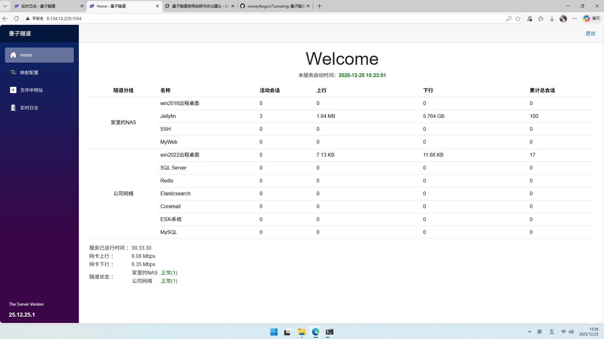

# 量子隧道（Tunneling）



## 1. 介绍

**量子隧道（Tunneling）** 是一款轻量级内网端口穿透工具，基于反向隧道技术。它通过一台公网服务器，将外部访问安全转发到内网服务，如远程桌面、Web、SSH、Jellyfin 等。

> 核心思路：内网客户端主动连接公网服务端，建立长连接；公网请求到达服务端后，再通过该通道转发到客户端的内网服务。

### 1.1 架构概览

- 服务端：部署在公网服务器，负责接收客户端连接、管理映射规则、转发外网请求。
- 客户端：运行在内网主机上，使用 `AccessToken` 与服务端建立隧道连接。
- `AccessToken` 由服务端定义，客户端和服务端一致才能建立隧道连接。
- 映射规则：在服务端配置 `MapGroups` 与 `MapProxy`，实现多环境、多主机、多端口的灵活穿透。

### 1.2 适用场景

- 家庭 NAS 或个人服务器远程访问
- 局域网内 Web 服务、数据库、SSH、远程桌面暴露
- 开发调试、远程办公、私有服务访问

## 2. 主要特点

- 支持 Windows / Linux / macOS
- 客户端无需公网 IP、无需路由器端口映射
- 支持多组映射、分组隔离管理
- `AccessToken` 认证确保连接安全
- 服务端与客户端均支持以服务方式运行，开机自启

## 3. 文件说明

发布包一般包含：

- `Tunneling.Server.exe` / `Tunneling.Server`
- `Tunneling.Client.exe` / `Tunneling.Client`
- `appsettings.json`
- `README.md`

## 4. 系统要求

- Windows / Linux / macOS 均支持
- 服务端与客户端可以混搭使用，即：`使用了部署在linux的服务端，客户端也可以使用windows的客户端`
- 服务器端部署在具有公网 IP 的主机上
- 服务端需要放行 `urls` 中指定端口以及所有 `MapProxy.PublicPort`

## 5. 服务端部署

### 5.1 部署步骤

1. 将服务端可执行文件与 `appsettings.json` 放在同一目录。
2. 编辑 `appsettings.json`。
3. 确保服务器防火墙/安全组放行所需端口。
4. 运行服务端程序。

### 5.2 服务端配置示例

```json
{
  "Logging": {
    "LogLevel": {
      "Default": "Information",
      "Microsoft.AspNetCore": "Warning"
    }
  },
  "AllowedHosts": "*",
  "urls": "http://*:1984",
  "SystemConfig": {
    "UserName": "admin",
    "Password": "123123",
    "MapGroups": [
      {
        "GroupName": "家里的NAS",
        "AccessToken": "A982D360-E59E-4012-B4AF-E571169218AA",
        "MapProxy": [
          {
            "Name": "win2016远程桌面",
            "PublicPort": 2000,
            "LocalHost": "192.168.1.234",
            "LocalPort": 3389,
            "Policy": {
              "Time": "00:03:00",
              "Threshold": 3
            }
          },
          {
            "Name": "Jellyfin",
            "PublicPort": 8096,
            "LocalHost": "192.168.1.250",
            "LocalPort": 8096
          }
        ]
      },
      {
        "GroupName": "公司网络",
        "AccessToken": "C795479D-800E-49D9-BC38-A0B91B8A5544",
        "MapProxy": [
          {
            "Name": "win2022远程桌面",
            "PublicPort": 4000,
            "LocalHost": "192.168.1.248",
            "LocalPort": 3389
          },
          {
            "Name": "SQL Server",
            "PublicPort": 21433,
            "LocalHost": "127.0.0.1",
            "LocalPort": 1433
          }
        ]
      }
    ]
  }
}
```

### 5.3 服务端配置说明

#### `SystemConfig.MapGroups`

<table style="width:100%; border-collapse: collapse; margin-bottom: 20px;">
  <thead>
    <tr>
      <th style="border:1px solid #ddd; padding:8px; text-align:left; background-color:#f2f2f2;">字段</th>
      <th style="border:1px solid #ddd; padding:8px; text-align:left; background-color:#f2f2f2;">说明</th>
      <th style="border:1px solid #ddd; padding:8px; text-align:left; background-color:#f2f2f2;">是否必填</th>
    </tr>
  </thead>
  <tbody>
    <tr>
      <td style="border:1px solid #ddd; padding:8px;">`GroupName`</td>
      <td style="border:1px solid #ddd; padding:8px;">分组名称，用于区分不同内网环境</td>
      <td style="border:1px solid #ddd; padding:8px;">是</td>
    </tr>
    <tr>
      <td style="border:1px solid #ddd; padding:8px;">`AccessToken`</td>
      <td style="border:1px solid #ddd; padding:8px;">组认证令牌，必须与客户端一致</td>
      <td style="border:1px solid #ddd; padding:8px;">是</td>
    </tr>
    <tr>
      <td style="border:1px solid #ddd; padding:8px;">`MapProxy`</td>
      <td style="border:1px solid #ddd; padding:8px;">当前分组的映射规则列表</td>
      <td style="border:1px solid #ddd; padding:8px;">是</td>
    </tr>
  </tbody>
</table>

#### `MapProxy` 字段

<table style="width:100%; border-collapse: collapse; margin-bottom: 20px;">
  <thead>
    <tr>
      <th style="border:1px solid #ddd; padding:8px; text-align:left; background-color:#f2f2f2;">字段</th>
      <th style="border:1px solid #ddd; padding:8px; text-align:left; background-color:#f2f2f2;">说明</th>
      <th style="border:1px solid #ddd; padding:8px; text-align:left; background-color:#f2f2f2;">是否必填</th>
    </tr>
  </thead>
  <tbody>
    <tr>
      <td style="border:1px solid #ddd; padding:8px;">`Name`</td>
      <td style="border:1px solid #ddd; padding:8px;">映射名称，仅用于日志和管理</td>
      <td style="border:1px solid #ddd; padding:8px;">是</td>
    </tr>
    <tr>
      <td style="border:1px solid #ddd; padding:8px;">`PublicPort`</td>
      <td style="border:1px solid #ddd; padding:8px;">公网访问端口</td>
      <td style="border:1px solid #ddd; padding:8px;">是</td>
    </tr>
    <tr>
      <td style="border:1px solid #ddd; padding:8px;">`LocalHost`</td>
      <td style="border:1px solid #ddd; padding:8px;">内网目标主机 IP</td>
      <td style="border:1px solid #ddd; padding:8px;">是</td>
    </tr>
    <tr>
      <td style="border:1px solid #ddd; padding:8px;">`LocalPort`</td>
      <td style="border:1px solid #ddd; padding:8px;">内网目标服务端口</td>
      <td style="border:1px solid #ddd; padding:8px;">是</td>
    </tr>
    <tr>
      <td style="border:1px solid #ddd; padding:8px;">`Policy`</td>
      <td style="border:1px solid #ddd; padding:8px;">可选防暴破策略</td>
      <td style="border:1px solid #ddd; padding:8px;">否</td>
    </tr>
  </tbody>
</table>

#### 示例映射效果

<table style="width:100%; border-collapse: collapse; margin-bottom: 20px;">
  <thead>
    <tr>
      <th style="border:1px solid #ddd; padding:8px; text-align:left; background-color:#f2f2f2;">映射名称</th>
      <th style="border:1px solid #ddd; padding:8px; text-align:left; background-color:#f2f2f2;">外网访问地址</th>
      <th style="border:1px solid #ddd; padding:8px; text-align:left; background-color:#f2f2f2;">内网目标服务</th>
    </tr>
  </thead>
  <tbody>
    <tr>
      <td style="border:1px solid #ddd; padding:8px;">远程桌面</td>
      <td style="border:1px solid #ddd; padding:8px;">`8.134.13.229:2000`</td>
      <td style="border:1px solid #ddd; padding:8px;">`192.168.1.234:3389`</td>
    </tr>
    <tr>
      <td style="border:1px solid #ddd; padding:8px;">Jellyfin</td>
      <td style="border:1px solid #ddd; padding:8px;">`8.134.13.229:8096`</td>
      <td style="border:1px solid #ddd; padding:8px;">`192.168.1.250:8096`</td>
    </tr>
    <tr>
      <td style="border:1px solid #ddd; padding:8px;">SSH</td>
      <td style="border:1px solid #ddd; padding:8px;">`8.134.13.229:10022`</td>
      <td style="border:1px solid #ddd; padding:8px;">`192.168.1.239:22`</td>
    </tr>
    <tr>
      <td style="border:1px solid #ddd; padding:8px;">MyWeb</td>
      <td style="border:1px solid #ddd; padding:8px;">`8.134.13.229:8080`</td>
      <td style="border:1px solid #ddd; padding:8px;">`192.168.1.248:80`</td>
    </tr>
  </tbody>
</table>

### 5.4 Policy 防暴破策略

`Policy` 用于限制同一 IP 的连接频率，减少暴力破解风险。

<table style="width:100%; border-collapse: collapse; margin-bottom: 20px;">
  <thead>
    <tr>
      <th style="border:1px solid #ddd; padding:8px; text-align:left; background-color:#f2f2f2;">字段</th>
      <th style="border:1px solid #ddd; padding:8px; text-align:left; background-color:#f2f2f2;">说明</th>
      <th style="border:1px solid #ddd; padding:8px; text-align:left; background-color:#f2f2f2;">是否必填</th>
    </tr>
  </thead>
  <tbody>
    <tr>
      <td style="border:1px solid #ddd; padding:8px;">`Time`</td>
      <td style="border:1px solid #ddd; padding:8px;">时间窗口，格式 `HH:MM:SS`</td>
      <td style="border:1px solid #ddd; padding:8px;">是</td>
    </tr>
    <tr>
      <td style="border:1px solid #ddd; padding:8px;">`Threshold`</td>
      <td style="border:1px solid #ddd; padding:8px;">该窗口内允许的最大连接次数</td>
      <td style="border:1px solid #ddd; padding:8px;">是</td>
    </tr>
  </tbody>
</table>

#### 示例

```json
"Policy": {
  "Time": "00:03:00",
  "Threshold": 3
}
```

- 含义：同一 IP 在 3 分钟内连接超过 3 次则暂时拒绝。
- 推荐值：远程桌面 `00:05:00` / `Threshold` 3，普通服务可适当提高到 5。

## 6. 服务端安装为 Windows 服务

推荐将服务端安装为 Windows 服务，方便开机自启和稳定运行。

> `--install` / `--uninstall` 是 Windows 服务专用参数，仅适用于 Windows 版本。Linux/macOS 请使用 systemd 或其他后台运行方式。

### 6.1 安装

```cmd
Tunneling.Server.exe --install
```

### 6.2 卸载

```cmd
Tunneling.Server.exe --uninstall
```

> 程序会自动检查服务是否存在，避免重复创建或删除失败。

## 7. 客户端部署

### 7.1 客户端配置示例

将客户端可执行文件与 `appsettings.json` 放在同一目录。

```json
{
  "Logging": {
    "LogLevel": {
      "Default": "Information",
      "Microsoft": "Warning"
    }
  },
  "Server": {
    "ServerAddress": "http://8.134.13.229:1984/",
    "AccessToken": "A982D360-E59E-4012-B4AF-E571169218AA"
  }
}
```

- `ServerAddress`：服务端地址，必须以 `http://` 或 `https://` 开头，末尾带 `/`。
- `AccessToken`：必须与服务端对应分组一致。

### 7.2 Windows 运行

#### 控制台模式（调试用）

```cmd
Tunneling.Client.exe
```

#### 安装为 Windows 服务

Server端和Client端均支持注册为windows服务

```cmd
Tunneling.Client.exe --install
Tunneling.Server.exe --install
```

#### 卸载服务

```cmd
Tunneling.Client.exe --uninstall
Tunneling.Server.exe --uninstall
```

> `--install` / `--uninstall` 是 Windows 服务专用参数，仅适用于 Windows 平台。

#### 管理服务

```cmd
sc start TunnelingClient
sc stop TunnelingClient
sc query TunnelingClient
```

### 7.3 Linux / macOS 运行

```bash
chmod +x Tunneling.Client
./Tunneling.Client
```

#### 推荐使用 systemd

保存为 `/etc/systemd/system/tunneling.service`：

```bash
[Unit]
Description=Tunneling Client Service
After=network.target

[Service]
Type=simple
User=root
WorkingDirectory=/opt/tunneling
ExecStart=/opt/tunneling/Tunneling.Client
Restart=on-failure
RestartSec=5
TimeoutStartSec=30
KillMode=process
SyslogIdentifier=Tunneling.Client

[Install]
WantedBy=multi-user.target
```

```bash
sudo systemctl daemon-reload
sudo systemctl enable tunneling.service
sudo systemctl start tunneling.service
sudo systemctl status tunneling.service
```

#### 非 systemd 运行

```bash
nohup /opt/tunneling/Tunneling.Client > /var/log/tunneling.log 2>&1 &
```

> 根据实际部署路径调整 `WorkingDirectory` 和可执行文件位置。

## 8. 使用方式

外网访问时，直接使用服务端公网 IP + `PublicPort`，即可连接内网目标服务。

## 9. 安全建议

- 服务端账户 `UserName` / `Password` 请选择强密码。
- `AccessToken` 请设置复杂字符串随机值，且每个 `MapGroups` 不同。
- 确保服务端所在服务器安全可靠。
- 只放行必要端口，避免无关端口暴露。

## 10. 常见问题

- 客户端无法连接：检查 `ServerAddress`、端口是否放通、`AccessToken` 是否一致。
- 外网访问失败：确认服务端是否在线，客户端是否已连接，查看服务端日志。
- Windows 服务异常：使用“事件查看器”排查服务启动失败原因。

---

如需进一步调整文档结构或补充说明，我可以继续帮你优化。
